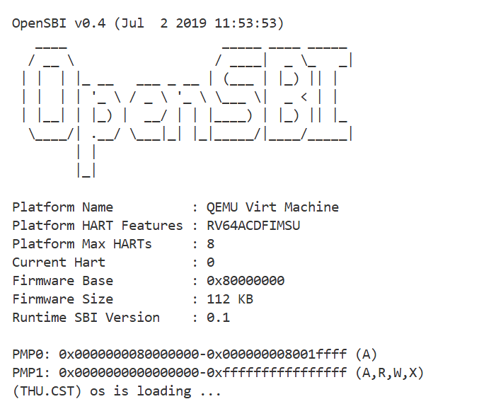

### 1、练习一：

操作系统的内核启动是从计算机加电到内核完全运行的渐进过程，具体流程是：硬件加电与固件初始化、引导程序加载内核、内核入口与汇编阶段初始化、C 语言阶段核心初始化、启动用户空间。

首先对于第一条指令:
```bash
la sp, bootstacktop
```
指令la是一个地址加载指令，用于将符号地址加载到栈指针寄存器中，这条指令的具体含义就是将符号bootstacktop的地址加载到栈指针寄存器sp中。bootstacktop是预留的内核栈空间的顶部地址，这条指令的目的就是初始化内核栈指针，在内核从汇编阶段进入 C 语言阶段前，分配并初始化栈空间，为后续代码提供运行必需的栈环境。

然后对于第二条指令:
```bash
tail kern_init
```
tail是 RISC-V 的尾调用跳转指令，功能是跳转到kern_init函数执行，且不将返回地址保存到栈中。这条指令跳转到使用c语言编写的kern_init函数，跳转传递控制权，内核启动就从汇编阶段初始化转到了c语言阶段核心初始化的流程，使用c语言来实现更加复杂的逻辑。

可以看到，上述的两个指令是紧密相关的，是属于链接汇编阶段与c语言阶段的部分，先通过分配并初始化栈空间，保证c函数正常调用，然后通过跳转完成控制权转移，让内核进入的高级语言初始化阶段。


### 2、练习二：
加电开始
```bash
(gdb) p $pc
$1 = (void (*)()) 0x1000
```
这是默认的起始pc
```bash
(gdb) x/7i $pc
=> 0x1000:      auipc   t0,0x0
   0x1004:      addi    a1,t0,32
   0x1008:      csrr    a0,mhartid
   0x100c:      ld      t0,24(t0)
   0x1010:      jr      t0
   0x1014:      unimp
   0x1016:      unimp
```
观察后续指令，a1很可能存储 "硬件配置信息的地址"，所存值`0x1020: 0x260d0000edfe0dd0`<br>
csrr（Control and Status Register Read）读取控制状态寄存器mhartid的值，存入a0寄存器。<br>
mhartid是 RISC-V 的 “硬件线程 ID 寄存器”，存储当前核心（在多核处理器中）的唯一标识（单核时通常为 0）。<br>
最后jr进行指令跳转，我们读取t0
```bash
(gdb) x/g 0x1018
0x1018: 0x0000000080000000
```
转到0x80000000执行，我们直接设置断点进行观察。
```bash
(gdb) x/5i $pc
=> 0x80000000:  csrr    a6,mhartid
   0x80000004:  bgtz    a6,0x80000108
   0x80000008:  auipc   t0,0x0
   0x8000000c:  addi    t0,t0,1032
   0x80000010:  auipc   t1,0x0
```
观察如上几条指令，接下来尝试直接查看内核加载瞬间。我们通过如下指令：

```bash
watch *0x80200000
```

在内核加载入口地址（0x80200000）添加watch。     
但由于：
`-device loader,file=$(UCOREIMG),addr=0x80200000`，
导致内核加载在qemu启动后执行指令前已经完成：
```bash
The target architecture is set to "riscv:rv64".
Remote debugging using localhost:1234
0x0000000000001000 in ?? ()
(gdb) x/i 0x80200000
   0x80200000 <kern_entry>:     auipc   sp,0x3
```
此时代码已经被写入地址当中，所以我们希望通过watch看到的地址变化情况没有出现。


接下来详细分析加载的内容，通过gdb调试查找到bootstacktop：
```bash
(gdb) info address bootstacktop
Symbol "bootstacktop" is at 0x80203000 in a file compiled without debugging.
```
但此时，bootstacktop并未写到sp寄存器中:
```bash
(gdb) info registers sp
`sp             0x0      0x0`
```

我们来分析这个栈顶地址是怎么得到的:
```bash
Symbols from "/home/op_user/projects/labcode/lab1/bin/kernel".
Remote target using gdb-specific protocol:
        `/home/op_user/projects/labcode/lab1/bin/kernel', file type elf64-littleriscv.
        Entry point: 0x80200000
        0x0000000080200000 - 0x00000000802004a2 is .text
        0x00000000802004a8 - 0x0000000080200718 is .rodata
        0x0000000080201000 - 0x0000000080203000 is .data
        0x0000000080203000 - 0x0000000080203008 is .sdata
```
我们可以发现，加载的入口位于`0x80200000`,然后存放.text(代码指令)以及.rodata（字符串，常量）
对于.data,我们观察entry.S中的代码
```
.section .data
    # .align 2^12
    .align PGSHIFT
    .global bootstack
bootstack:
    .space KSTACKSIZE
    .global bootstacktop
```
bootstack包含在data中，并且bootsatck占KSTACKSIZE（由mmu.h中的数据可算出所占大小0x2000），
由于data中未包含其他变量，bootstack从0x80201000开始到0x80203000结束，
bootsatcktop为0x80203000，与我们之前得到的数据相符

接下来，我们观察加载好的代码的作用。
```bash
(gdb) info address kern_entry
Symbol "kern_entry" is at 0x80200000 in a file compiled without debugging.
```
可以得知，从0x80200000处开始执行我的代码。
查看kern_entry的汇编代码
```bash
Dump of assembler code for function kern_entry:
   0x0000000080200000 <+0>:     auipc   sp,0x3
   0x0000000080200004 <+4>:     mv      sp,sp
   0x0000000080200008 <+8>:     j       0x8020000a <kern_init>
```
其中，这两条指令对应`la sp, bootstacktop`:
```bash
   0x0000000080200000 <+0>:     auipc   sp,0x3
   0x0000000080200004 <+4>:     mv      sp,sp
```
auipc将 20 位立即数左移 12 位后，与当前程序计数器（PC）的高 20 位相加，结果存入目标寄存器。
将0x80203000放入了sp中， mv相当于一条空指令，不需要addi微调。
我们打上断点，观察执行完后sp寄存器的值
```bash
(gdb) b *0x0000000080200004
Breakpoint 1 at 0x80200004: file kern/init/entry.S, line 7.

(gdb) info registers sp
sp             0x80203000       0x80203000 <SBI_CONSOLE_PUTCHAR>
```
已经成功将bootstacktop写入到sp中
最后进行跳转，执行kern_init。





可见，已经输出了字符串，说明kern_init函数被执行，成功加载。
### 3.1 实验知识点与 OS 原理知识点的对应关系

| 实验中的知识点 | 对应的 OS 原理知识点 | 含义、关系与差异分析 |
|----------------|--------------------|------------------------|
| **OpenSBI（硬件初始化+加载内核+硬件与内核连接）** | Bootloader、硬件抽象层（HAL） | **关系：** OpenSBI 是一种 RISC-V 架构下特有的固件，在包含 Bootloader 功能的同时，也负责 HAL 部分的操作；<br> **差异：** 普通 Bootloader 主要负责加载内核，而 OpenSBI 还包括配置 RISC-V 特权态（M/S/U 态）、提供内核调用的硬件服务接口等功能,在此实验中提供了字符输出的接口。 |
| **内核栈初始化（`la sp, bootstacktop`）** | 进程与内核的初始化 | **关系：** 课程中讲解了“进程执行需要先初始化栈”的规则。在此次实验中，我们可以发现对内核同样适用类似规则；<br> **差异：** 用户进程的栈是由内核分配的，而内核的栈需在启动时通过汇编代码进行初始化，并且其使用物理地址（。 |
| **内核入口跳转（`tail kern_init`）** | OS 启动流程 | **关系：** 课程中讲了分层启动逻辑（汇编完成底层硬件的初始化，C 语言实现操作系统本身），此次实验中的OS启动流程与讲解中的流程一致。 |
| **内核加载地址 `0x80200000` 的设定** | 内存地址空间划分 | **关系：** 实验中进行了简单的内存分区。同时，课程中讲到“内核与用户进程需占用不同内存区域”，而实验中通过固定内核地址 `0x80200000` 避免了与用户空间冲突； |

### 3.2 OS 课程讲解的原理中重要但实验未涉及的知识点

此次实验，主要进行了OS内核启动与调试相关操作，我们课程中讲授的一些重要知识点并未涉及：
- 进程管理与调度：课程中讲授的进程调度算法、进程控制块、进程创建和切换等进程方面的操作，此次实验中没有涉及；
<!-- - 设备管理与中断处理：课程中讲授的设备驱动模型、中断控制器、中断处理流程等，由于实验仅涉及初始化硬件，故未涉及设备I/O与中断响应相关； -->
- 文件系统：此次实验中，内核直接加载到内存，无需读取磁盘文件系统，故未涉及任何文件操作。课程中讲授的文件系统的层次结构、文件读写机制等未涉及；
<!-- - 死锁与同步互斥：此次实验中，没有多进程和多线程，无需同步互斥机制，不涉及课程中死锁的检测与避免、信号量和互斥锁等知识点； -->
- 内存管理的高级机制：上课时重点讲解的内存分区分配算法（最先匹配、最佳匹配等）、虚拟内存（逻辑地址到物理地址的转换等），在此次实验中未涉及，此次实验仅涉及物理地址。
